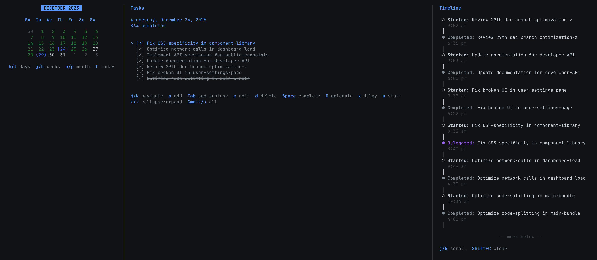

# Epoch



Epoch is a modern, terminal-based task logger and time tracker built with TypeScript, React, and Ink. It features a three-pane layout designed for efficiency and keyboard-centric workflows, allowing you to manage nested tasks and track your time without ever leaving the terminal.

## Features

- **Three-Pane Layout**: Seamlessly switch between Calendar, Tasks, and Timeline views.
- **Calendar View**: Navigate through months and days to visualize task distribution and select specific dates.
- **Infinite Nesting**: Break down complex projects with support for infinitely nested subtasks.
- **Activity Timeline**: Automatically logs every action (start, complete, delegate) with precise timestamps.
- **Task States**: Track tasks through 'todo', 'completed', 'delegated', and 'delayed' states.
- **Extensible Themes**: Comes with built-in dark and light themes (plus 20+ community themes like Catppuccin, Nord, Dracula).
- **Local Persistence**: Data is saved locally in JSON format for easy backup, portability, and privacy.

## Installation & Running

### Prerequisites
- Node.js (v16+ recommended)
- pnpm

### Setup

```bash
# Install dependencies
pnpm install

# Run in development mode (with hot reload)
pnpm dev

# Build and start production version
pnpm build
pnpm start
```

## Keyboard Shortcuts

Epoch is designed to be used entirely without a mouse.

### Global Navigation
- `1` / `2` / `3`: Switch directly to Calendar / Tasks / Timeline panes
- `Tab` / `Shift+Tab`: Cycle through panes
- `?`: Toggle help dialog
- `q`: Quit application

### Calendar Pane
- `j` / `k` (or `↓` / `↑`): Navigate weeks
- `h` / `l` (or `←` / `→`): Navigate days
- `n` / `p`: Next / Previous month
- `Enter`: Select date

### Tasks Pane
- `a`: Add new task
- `e`: Edit task title
- `d`: Delete task
- `Space`: Toggle completion status
- `s`: Start task (sets start time)
- `D`: Mark as delegated
- `x`: Mark as delayed/cancelled
- `Tab`: Indent task (convert to subtask)
- `Shift+Tab`: Unindent task
- `Enter`: Expand/Collapse subtasks

### Timeline Pane
- `j` / `k`: Scroll through activity history
- `t`: Toggle theme (Dark/Light)

## Data Storage

Your data is stored locally in a human-readable JSON file. This allows for easy backups or manual editing if necessary.

- **macOS**: `~/Library/Application Support/epoch/data.json`
- **Linux**: `~/.local/share/epoch/data.json` (or `$XDG_DATA_HOME`)
- **Windows**: `%APPDATA%\epoch\data.json`

## Tech Stack

- **UI Framework**: React + Ink
- **Language**: TypeScript
- **State Management**: React Context
- **Date Handling**: date-fns
- **Persistence**: File System (JSON)

## Author

Created by [Akshat Dubey](mailto:akshatdubey0808@gmail.com).

